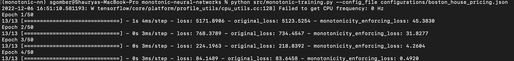

# Table of Contents

1. [Introduction](#introduction)
2. [Methodology](#methodology)
3. [Installation](#installation)
4. [Usage](#usage)
5. [References](#references)


# Introduction

Deep Neural Networks (DNNs) are used in many vital applications, such as determining loan grant decisions and serving as the controllers for autonomous cars, due to their effectiveness and efficacy in performing complex tasks. In these circumstances, the DNNs must frequently adhere to certain domain-specific requirements. Monotonicity is one such requirement.

A Deep Neural Network is monotonically increasing with respect to some input features if the output of the network increases if we increase the values of those features. Similarly, monotonically decreasing would mean that the output of the network decreases with increase in value of the features.

Some real-life examples include:

- Increase in salary should give increased predicted loan amount.
- Increase in number of rooms should give increased predicted house price.
- Decrease in crime rate of area should give increased predicted house price.
- Increase in hours per week should give increased predicted income level.

If DNNs are used to solve the tasks mentioned above, then it is critical for explainability and reliability purposes that the networks follow the above mentioned requirements. If not, then it can be difficult to trust them.

# Methodology

To achieve monotonicity while trainings DNNs, we implement the Point-wise monotonic loss approach by Gupta et. al. [1]. Please refer to [monotonic-training.py](src/monotonic-training.py) for the implementation. The method ```monotonicity_enforcing_loss``` has the main logic to compute the monotonicity based loss. This can either be imported and used while
creating your custom models, or can be directly used with pre-compiled models using the steps mentioned below.

# Installation

1. Install `python` >= 3.8.3, Install `pip` >= 20.1.1
2. Set up the virtual environment
    ```
    pip3 install virtualenv
    python3 -m venv monotonic-nn
    source monotonic-nn/bin/activate
    ```
3. Install needed packages
    ```
    pip install pandas keras tensorflow 
    ```
# Usage

1. Create a configuration file (like the one present here: [configurations/boston_house_pricing.json](configurations/boston_house_pricing.json)).

    ```json
    {
        "train_data_file_path" : "./data/boston_house_pricing/training_data.csv",
        "test_data_file_path" : "./data/boston_house_pricing/testing_data.csv",
        "pred_value_col_name" : "HousePrice",
        "model_file_path": "./data/boston_house_pricing/model.h5",
        "monotonicity_parameters": {
            "monotonic_column_names" : ["rm", "crim"],
            "monotonicity_directions" : [1, 0],
            "monotonicity_weight" : 1000
        },
        "training_params": {
            "epochs" : 50,
            "batch_size" : 32
        }
    }
    ```

    Description of the fields:

    1. train_data_file_path: Path to the file containing training data.
    2. test_data_file_path: Path to the file containing testing data.
    3. pred_value_col_name: Name of the column that is being predicted (this will be used to get the expected output labels).
    4. model_file_path: Your model compiled and saved as ".h5" file. It should have the loss to be used for accuracy and the optimizer to be used before compilation as the monotonic training uses these.
    5. monotonicity_parameters: Parameters that determine the monotonicity related information.
        -  monotonic_column_names: The columns on which we want the monotonicity.
        - monotonicity_directions: i<sup>th</sup> value depicts whether we want the function to be monotonically increasing or decreasing with the i<sup>th</sup> feature: 1 represents increasing while 0 represents decreasing.
        - monotonicity_weight: The weight (or scale) by which the monotonicity loss should be multiplied. This depends on the original empirical loss used by the model and also on how strongly you want the monotonicity to be enforced.
    
    6. training_params: Parameters determining training phase related configurations.
        -  epochs: Number of epochs for which to do the monotonic training.
        - batch_size: Batch size to use while training.


2. Once this is done, simply running the following command with your configuration file starts the monotonic training:

    ```
    python src/monotonic-training.py --config_file configurations/boston_house_pricing.json
    ```

    Executing this will start the training as follows:
    

    As can be seen, while training, we monitor both losses, the original as well
    as the monotonicity enforcing one. The monotonic training process efficiently optimizes the problem by reducing both losses at the same time, thus giving us 
    monotonic functions with good accuracy!

# References

1. [Akhil Gupta, Naman Shukla, Lavanya Marla, Arinbjörn Kolbeinsson, and Kartik Yellepeddi.
How to incorporate monotonicity in deep networks while preserving flexibility?](https://arxiv.org/abs/1909.10662)

